# WORDFINDER

## Site Overview
Wordfinder is a word-based game, where a user must find as many 4+ letter words in multiple sets of seven or eight randomly generated letters against the clock as they can. With the option of numerous different game settings, each providing its own stored and displayed best score for a user, the game is varied and long-lasting with regard to its enjoyment and playability. The target audience for this game is most broadly anyone who enjoys word-based games, of which there are many. 

## Design Process
This section details the stages of the design process followed during the development of the site.

### Strategy

#### User Stories
- As a player of word-based games, I prefer the game to be fairly intuitive, with instructions clear, concise and easy to access at any point during the game.
- As a player of online games, I like to be able to play the game on both mobile, tablet and desktop, without significant disruption to how the game looks and feels, or the mechanism by which I play it. I also prefer to not have to scroll, so that I can view the instructions, game setup and playing areas all at once, thus remaining fully immersed in the game itself.
- As a fan of browser-based games including word games, I always want simple playing controls. Additionally I want the game related buttons to make it effortless to start and quit the game, as well as change any settings.
- As a player of word-based games I like there to be feedback that not only provides the information I need, but does so in an appealing fashion.  I also like to have game sounds as part of this feedback which makes it fun to play; although I want to be able to easily disable/enable the sounds when desired.
- As a fan of word games, I like there to be a moderate degree of variability in a game, with multiple game modes that change the difficulty of the game, as well as how long it takes to complete: often I may only want a short game as I only have a small amount of time.
- As someone who plays word games, I like there to be information displayed during a game and at the end of a game summarising my performance, particularly if I am trying to achieve some target against the clock, where knowing what my current score is and how much time I have left simultaneously, is a necessity for it to be worthwhile.
- As a competitive gamer, I want any single player game, to have some kind of metric of my performance that allows me to indirectly compete with other players.

#### Site Owner Story
The goal is to produce a word-based game that is entertaining to the user, and of sufficient variability as to not become too repetitive and dull.  As well as being entertaining, the game should also provide a form of mental stimulation akin to brain training games, in that it challenges the user to focus and search for words in sets of random letters, whilst under time pressure. Finally the game should have a competitive component, whereby users can compare their performance with other users.

### Scope

#### Site key functions and content:
In order to meet the goal of the site owner, as well as satisfy the potential users, the site-hosted word game will minimally require the following functions and content:
- It should be fully responsive and or adaptive to all types of device, in a way that removes any need for page scrolling and maintains a consistent appearance
- An easy-to-access and concise set of game instructions
- An easy-to-access and modify set of game settings, providing multiple game mode options
- Have game mechanics that prevent it being repetitive, with every game being different
- Provide appealing feedback to a player during and at the end of a game
- Include sound effects, that can be disabled and enabled at the discretion of the player
- Provide a straightforward game interface/game controls to play the game, that are fairly intuitive so that minimal instructions are needed.
- Have a displayed game timer 
- Display and produce various metrics that give a player useful information during a game for the purpose of achieving a target such as a new best score
- Have a competitive metric such as the best score for each different game mode, that can be stored and updated locally for every player

### Structure/Skeleton

A reasonably minimalistic and compact design is preferred in order to make the game appealing and simple, whilst minimising any distractions from the main gameplay area. The page 
is to be sized and styled responsively such that for as many device sizes as possible, in both landscape and portrait orientation, there is zero need for vertical scrolling. The potential trade-off being ease of legibility and or ease of interaction with the interactive elements. There will be no footer or navigation element as they are unnecessary, since there is no footer content, and only one page on the site. There will be a header containing a title and a game description.

The main section of the page is to be divided into two, first a game preamble section, and then a main game area section. The preamble section is to be further divided into a how to play section, and a game settings section. Each section will contain a window that can be opened and closed using buttons, thus decluttering the page and saving vertical space. The vertical order of each preamble section is the order in which they will naturally be used by a user. The how to play section will feature a game instructions button that will allow the user to view the game instructions situated on the how to play window; on first loading the page this window will initially be opened, in part to make the instructions easy to view to users who naturally will want to read the instructions before playing, but also to encourage users who tend not to read them first, to at least give them a cursory glance so as to avoid later user confusion and thus frustration when attempting to play the game.

The game settings section will feature a game settings button that opens the game settings window. The window will include a timer, letter mode, and sound mode set of inputs to allow the user to easily change the game mode and enable or disable game sounds. In order to avoid giving the user an unpleasant surprise, the sound mode 'off' input will be checked by default.

The main game area section will contain a start button, followed by three flex item sections arranged vertically in portrait orientations, and horizontally in landscape orientations. The central section will be the gameplay area, where the letter tiles and tile holders of the game will be located, as well as a range of buttons needed to play the game. The outer sections will contain either the game timer and other game buttons or the game scores. 

Aside from the buttons, the main gameplay interface will involve clicking a displayed letter tile to select it, and then clicking an empty tile holder to place a letter there. A click and drag interface while possible does not perform as well on touchscreen devices.

[Landscape wireframe](docs/wireframes/wordfinder_wireframe.png)

### Surface
All buttons are to be given a form of focus, such that when a user hovers over or clicks a button, a border color change will occur. Likewise the user will receive feedback when selecting a letter tile, again with a border color change indicating that the tile has been selected. When a user submits a word, alerts will be produced indicating a correct word, incorrect word, as well as whether a word has already been submitted; when the timer runs out the user will also be notified and receive game summary statistics and a high score alert if one is achieved. Finally when sound is enabled, game sound effects will accompany the game start and game end, as well as correct and incorrect submitted word alerts; this should enhance user feedback and make the game more rewarding to play.

#### Typography
Three google fonts will be used: 'Bungee Inline' for headings; 'Luckiest Guy' for buttons; and 'Orbitron' for general text. Collectively these fonts were chosen for their softer, more informal appearance, as well as for their somewhat futuristic style that make the game look more appealing/inviting and modern.

#### Color Scheme
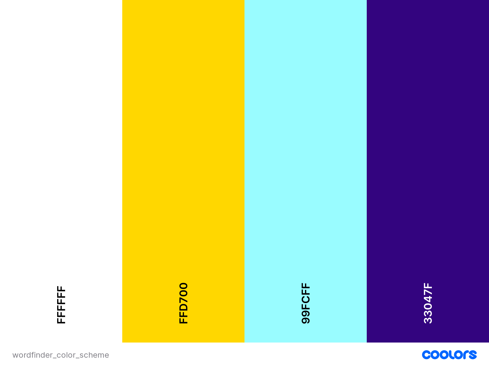

The color scheme creation was assisted by using the [coolors](https://coolors.co/?home) website.
The purple and blue colors will be the primary colors used, chosen to maximise contrast and to make the site look bold and bright, and thus appealing to a user. The gold and white colors will be used for the letter tiles and their holders as well as for focus/feedback effects.

## Existing implemented features

### Header
The header includes a game title and short game description to give a user a clear immediate impression of the purpose of the site, and also what the game involves.

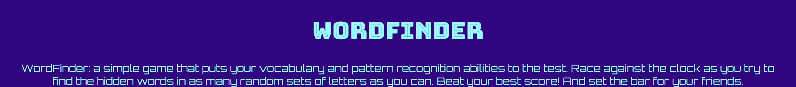

### How To Play section and How To Play window
This section is clearly titled to indicate its purpose and direct the users focus, who will likely be seeking information on how to the play game. Inside the section is a clearly visible button labelled game instructions, again making its function obvious to the user. Hovering over or clicking the button gives it a gold border, thus providing user feedback. 

Upon clicking the button a bordered popup window titled 'HOW TO PLAY' opens obscuring the page content behind it. It contains a set of game instructions as well as other explanatory content about the scoring system and different game modes. This information provides everything a user needs to know about the game, including an additional note advising them to adjust their browser settings for autoplaying of sounds if they enable game sounds. The window also contains a close button whose function should be obvious to the user. Upon page loading this window is initially open to make the game instructions immediately available without user effort; a downside to this as indicated by some user feedback, is that it makes the page look more cluttered when first seen.

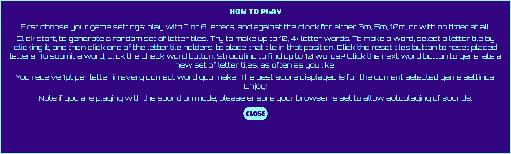

### Game Settings section and window
Just like the how to play section, this section is titled with a suggestive title, indicating without doubt the purpose of the section. It contains a game settings button which like all buttons on the page provides feedback when clicked or hovered over. 

When the button is clicked, it opens up the bordered popup game settings window in front of the existing page content.  It contains three sections arranged horizontally. Each section consists of a legend and a group of related radio inputs. The leftmost section consists of timer options, where a user can choose to have 3, 5 and 10 minutes on the timer, as well as a no timer option; checking an input automatically sets the timer display. A default time of 5m is checked in the event the user plays the game without opening the settings. 

The next group of inputs is for the letter mode, whereby a user can choose to play with 7 or 8 random sets of starting letter tiles; the 7 input is checked by default. Checking a letter number input automatically adjusts the number of visible tile holders and starting letter tiles. For both of these game mode sections, checking a different input midgame, quits the ongoing game --- thus preventing any strange effects or cheating. Additionally both of these sections provide sufficient game variability for the users, with arguably the 8 letter mode being easier to make smaller words from, and so changing the game difficulty; while the 3m timer option being suited to users short on time. Each mode also brings with it a different challenge and game intensity.

The final section of inputs allows the user to enable or disable sound effects, and this can be changed midgame if desired; by default the 'off' input is checked.

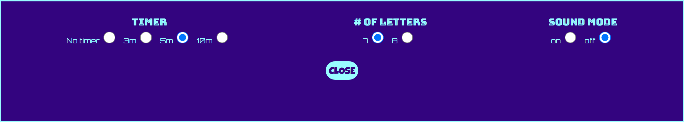

### Start/Quit button
At the top of the main game area section is a start button preceded by a 'lets play' heading, which demarcates the main game area, and also guides the user's attention to the location of the start button. Once clicked the start button transforms into a quit button indicated by a change in the button text. Clicking the start button starts the game timer, and causes the first set of random letter tiles to appear. Also if sound is enabled a game start sound is played indicating to the user that the game has started.

Clicking the quit button transforms it back into a start button with a change in button text, and resets the timer, and the tile holders by removing any letter tiles inside them; in addition the unplaced letter tiles are removed; finally the scores are reset.

 

### Letter tiles and tile holders
The letter tiles and holders are the key components of the game, and are what the user will interact with most. They are made as large as possible in the available space, so as to make them easy to click, as well as legible. Before clicking the start button, only the tile holders are present. Once the game is started a random row of 7 or 8 unplaced letter tiles, depending on the letter mode, appear above a row of an equal number of tile holders. The tile holders resemble the letter tiles except for containing any letter, in order to suggest to the user their function as a holder of letter tiles. A user selects a letter tile by clicking it, and a gold border appears to act as confirmation that a letter has been selected; clicking another letter tile again, deselects the previous tile, indicated by the removal of the gold border, and selects the just clicked tile, confirmed by giving it a gold border. The user can place a tile in any of the tile holders by clicking a tile holder after selecting a letter tile; the tile's letter content is then transferred to the holder as its content, and the selected letter tile is removed. A tile holder containing a letter cannot not be replaced by another unplaced letter tile through the same mechanism; the only way a user can remove any placed tiles in letter holders is by clicking the 'reset tiles' button located just below the tile holders for convenience. This button will empty all of the holders and restore any removed letter tiles to their original positions. 

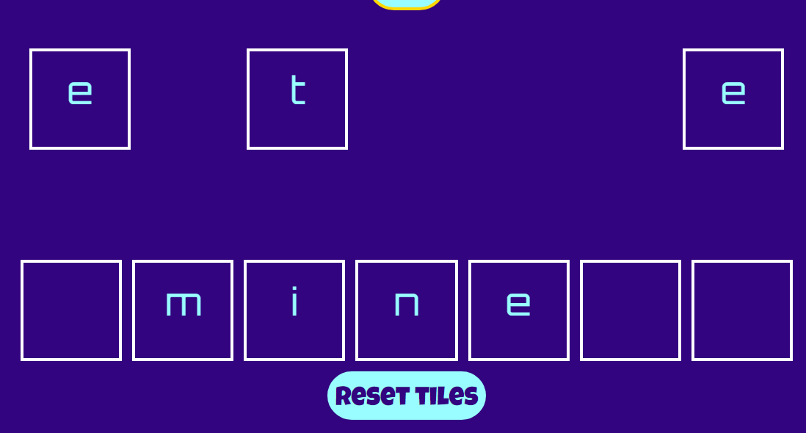 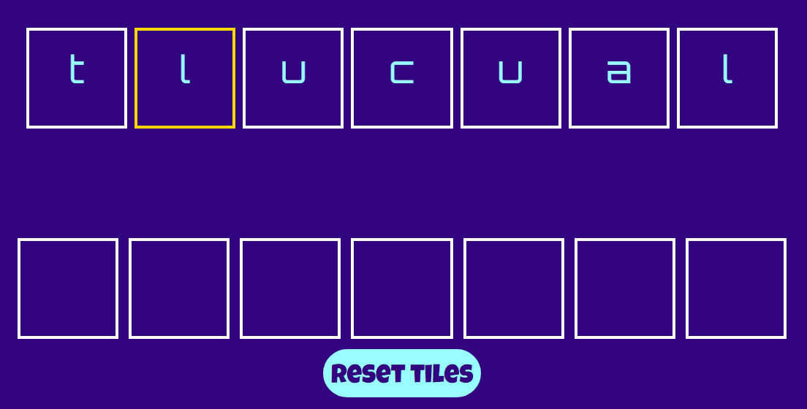

### Timer, check word, next word sidebar
The first of two sidebars --- that in landscape orientation are either side of the tiles and holders, and in portrait orientation above and below --- is the sidebar containing the game timer, and the check word and next word buttons. The game timer, which is markedly visible, is set to whichever timer option is chosen by the user, or 5 minutes by default. Upon starting the game the timer updates as the user would expect, and when reaching zero triggers the end of the game. This results in a sweetalert2 library alert being displayed indicating to the user that their time is up, as well as providing some performance summary statistics in the form of their current score, correct words given, and a points to words ratio, allowing a user to judge their performance and assess their progress. The use of the sweetalert2 library over a standard alert enhances the appearance and the user experience of receiving alerts. If the sound is enabled, a time up sound effect is also played, further enhancing the user experience. Additionally when the timer expires, the game is reset similarly to clicking the quit button, except that the best score will change if a new best score is achieved; if a new best score is achieved another sweetalert2 alert is triggered indicating to a user that they have obtained a new best score for the current game mode.

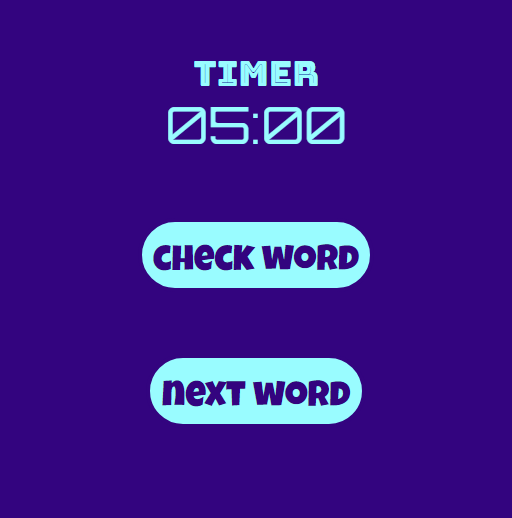  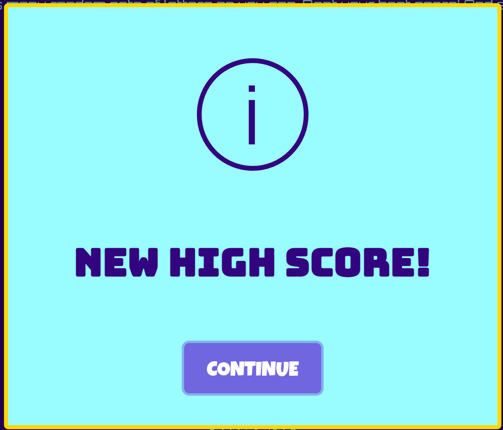

The check word button as its name indicates is used by a user to submit a word that they have placed in the letter tile holders, using the random set of letter tiles. Upon clicking the button the user will receive one of four sweetalert2 alerts: if the word is correct the user will receive an alert indicating so with a correct word sound effect, if sound is enabled; if the word is incorrect likewise the user will receive an incorrect word alert with an accompanying sound effect if sound is enabled; if the word submitted is less than 4 letters, the user is given feedback reminding them that submitted words must be at least 4 letters long; finally if the user has already submitted a correct word before, they will receive an alert informing them so, along with the incorrect word sound effect. After clicking the check word button the letter tile holders are automatically emptied and all the letter tiles restored, saving the user time and effort.

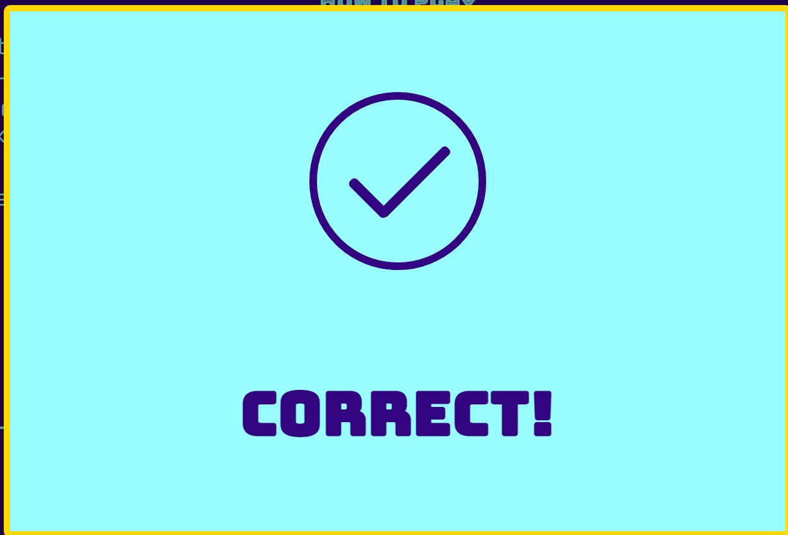 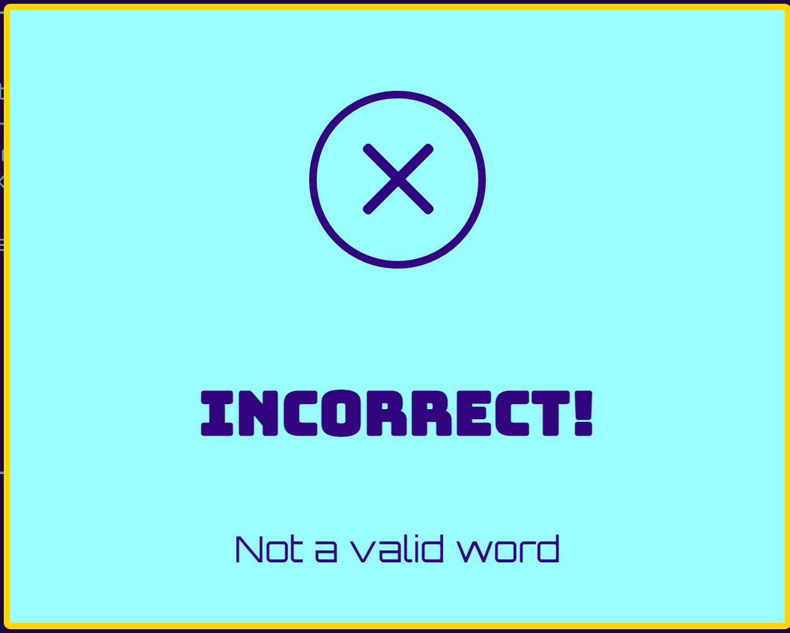 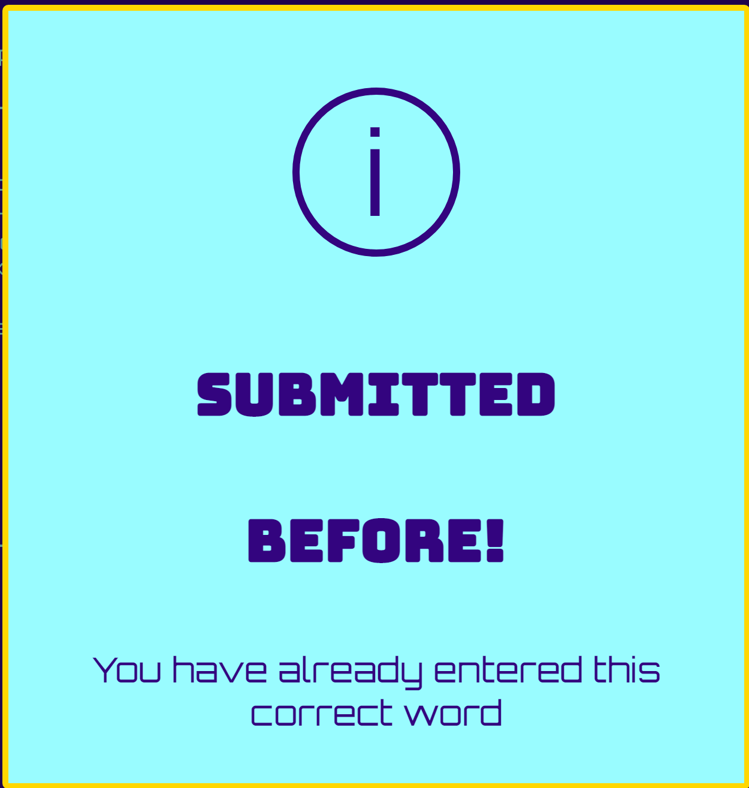 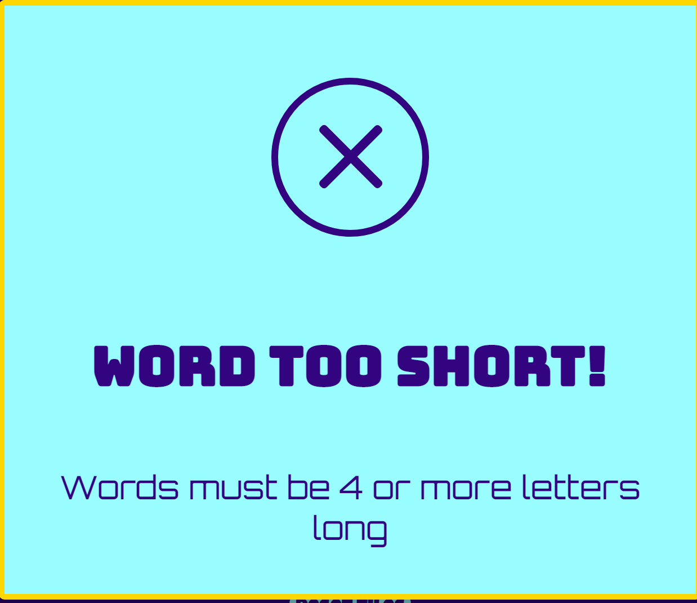

The next word button serves two purposes, one strategic, the other based around helping users struggling to find words in the current set of letter tiles. If a user finds 10 4+ correct letter words in a random set of letter tiles, then automatically a new set of random tiles is generated, replacing the existing tiles; this is mainly to avoid running out of available words. However if a user is struggling to find many, or even any words, in a given set of tiles, they may click the next word button to get a new set. This can be done indefinitely during a game, and prevents users becoming frustrated by getting stuck, and thus keeping the game flowing. For some users, the next word button can be used strategically in situations where they believe they could maximise their score by finding larger words in a different set of tiles as opposed to finding the last few smaller words in the current set. Clicking the next word button when the tile holders are not empty, also empties them along with removing the remaining unplaced letter tiles, before a new set is generated.

### Game scores sidebar
The second sidebar features three metrics, a current score, a correct word counter, and a best score. The current score updates during the game as correct words are submitted by the user, with a 1pt increase for every letter in every correct word submitted. The correct word counter simply as its name suggests, counts the number of correct words submitted. Both of these statistics allow the user to evaluate their progress in the current game, and can also potentially inform a user how many more of the 10 words are left for a given tile set. As mentioned elsewhere both of these statistics form part of the game summary seen by the user at the end of the game. Once a game is over both are reset to zero. 

The final metric of value to the user, is the best score tracker, which displays the current best score for the current game mode, and which dynamically changes as the user changes the game mode. If a user's current score at the end of a game surpasses the current best score, then the best score displayed is updated to reflect this. Using local storage allows all the best scores for a particular user to be stored in between game sessions, and so displayed every time the page is loaded on the same device. The best score is the primary performance measure, and is how a user can compete against and compare themselves with other users.

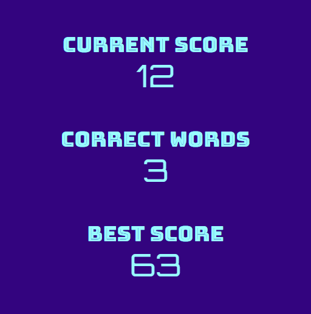

### Game mechanics features
The game relies on making fetch requests from the [datamuse API](https://www.datamuse.com/api/) in order to generate the sets of random letter tiles, as well as to generate the correct word array for a given set. As soon as the page loads, two prepopulated arrays of 5000 random 7 and 8 letter words are produced using successive fetch requests. Every time a user starts a new game or clicks the next word button, depending on the letter mode, a randomly chosen word is selected from one of these arrays. Additionally within a game session, code has been used so that a user cannot by chance have the same random set of letter tiles appear twice. A 5000 word array ensures that there are essentially, as far as the user can tell, a never ending variety of random letter tiles, ensuring the game does appear repetitive; what's more the order in which these tiles are ordered is random, so even if a user has a repeated word in between game sessions, they are unlikely to notice.

When a user submits a word made out of a set of letter tiles, this word is checked to see whether it is included in a filtered and sorted array of words made from 4+ of the letter tiles. Several fetch requests from the datamuse API produce a crude array of 'correct words' which is then filtered to remove any spurious words, including words containing invalid characters or containing too many of a given letter tile. The array is also sorted by using the Google books Ngrams word frequency, that ensures the most recognisable words are at the beginning of the array, reducing the iterating time, as well as making it easy from a development persepctive to check the reliability and accuracy of the correct words generated; this has provided assurance that the game works well, and a user is unlikely to be surprised by a valid word being deemed incorrect due to not featuring in the correct word array. 
