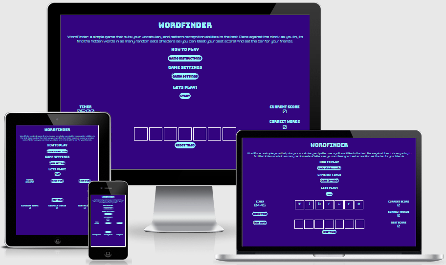

# WORDFINDER

## Site Overview
Wordfinder is a word-based game, where a user must find as many 4+ letter words in multiple sets of seven or eight randomly generated letters against the clock as they can. With the options of numerous different game settings, each providing its own stored and displayed best score for a user, the game is varied and long lasting with regard to its enjoyment and playability. The target audience for this game is most broadly anyone who enjoys word-based games, of which there are many. 

## Design Process

### Strategy

#### Site Owner Story
The goal is to produce a word-based game that is entertaining to the user, and of sufficient variability as to not become too repetitive and dull.  As well as being entertaining, the game should also provide a form of mental stimulation akin to brain training games, in that it challenges the user to focus and search for words in sets of random letters, whilst under time pressure.  Finally the game should have a competitive component, whereby users can compare their performance with other users.

